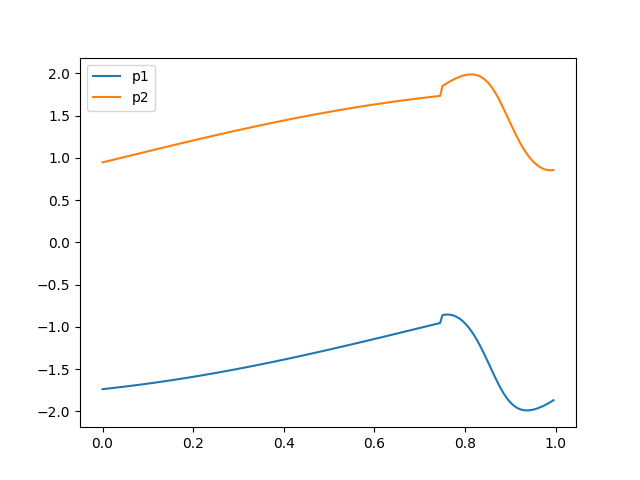

# Document Structure
|path|description|
|:-|:-|
|/doc|pdf file|
|/Core /Drivers|STM32 File|
|/Device|ICM20948 IMU Drivers file|
|/DogSoft|dog control function pack|
|/simulation|simulation pack. use c generate data and python to plot|

# core state of walk
> $\theta_{motor}=f(t)$

> end of foot path

# Contribute
* add branch by your name.
* tell me directly.
